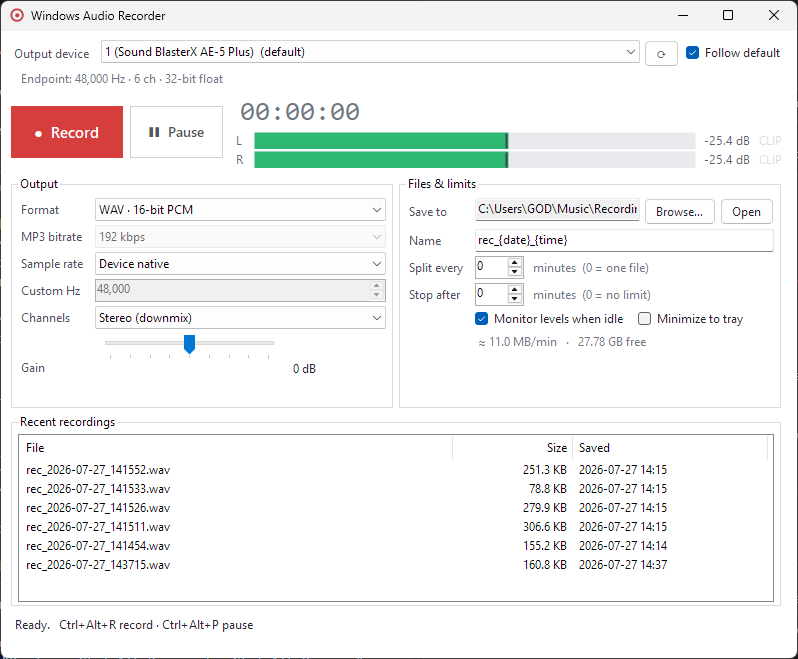

# Windows Audio Recorder

**Record whatever your PC is playing. One button, no virtual cables, no driver hacks.**

[](https://github.com/lionheartaaron/windows-audio-recorder/releases/latest)
[](https://github.com/lionheartaaron/windows-audio-recorder/actions/workflows/ci.yml)
[](https://www.microsoft.com/windows)
[](https://dotnet.microsoft.com/download)
[](LICENSE)



---

## Why this exists

It was so needlessly hard to just capture the audio of what was playing on my Windows machine.

Every path led somewhere annoying: install a virtual audio cable and rewire your default
playback device, dig through legacy "Stereo Mix" settings your driver may not even expose,
or run a full DAW to save a two-minute clip. Windows has had a first-class API for this
since Vista, **WASAPI loopback**, and it needs none of that. It taps the render endpoint
directly, so your speakers keep working, nothing gets rerouted, and no extra drivers get
installed.

This app is a thin wrapper around that API. Pick an output device, press Record.

## Features

- **Loopback capture from any playback device**: speakers, headphones, HDMI, virtual outputs.
- **No routing changes.** Your audio keeps playing normally while it records.
- **Live level meters** before you record, so you can confirm you picked the right device
  without committing to a take. Peak dB readout with a clip indicator per channel.
- **WAV (16-bit, 24-bit, 32-bit float) and MP3** output, with a sample-rate and channel
  converter in the chain.
- **Global hotkeys.** <kbd>Ctrl</kbd>+<kbd>Alt</kbd>+<kbd>R</kbd> to start/stop,
  <kbd>Ctrl</kbd>+<kbd>Alt</kbd>+<kbd>P</kbd> to pause, from any app.
- **Gain control** (-20 to +20 dB) that can be adjusted mid-recording.
- **Timed splitting and auto-stop.** Roll to a new file every N minutes, or stop after N.
- **Silence is recorded as silence.** WASAPI stops delivering packets entirely when the
  audio engine idles; the recorder pads the gap so file length always matches the clock.
- **Buffered in RAM, never dropped.** Captured audio is queued in memory and written out by a
  separate thread, so a slow or busy disk costs memory rather than samples.
- **Follows the default device.** Change your output in Windows and capture follows it.
- **Tray mode**, recent-recordings list, live size estimate and free-disk readout.
- Settings persist between runs. Nothing is sent anywhere; there is no telemetry.

## Download

Grab the latest build from the [**Releases**](https://github.com/lionheartaaron/windows-audio-recorder/releases/latest)
page:

| Asset | Use it when |
| --- | --- |
| `WindowsAudioRecorder-<version>-win-x64.msi` | Normal install: Start Menu entry, Add/Remove Programs, in-place upgrades. |
| `WindowsAudioRecorder-<version>-win-x64-portable.zip` | No install. Unzip anywhere and run `WindowAudioRecorder.exe`. |

Both are self-contained: they carry their own .NET runtime, so nothing else needs installing.
Windows 10 or 11, 64-bit.

> The installer isn't code-signed, so SmartScreen shows a *"Windows protected your PC"* prompt
> the first time. Click **More info** > **Run anyway**.

## Building from source

### Requirements

- Windows 10 or 11 (developed and tested on Windows 11)
- [.NET 10 SDK](https://dotnet.microsoft.com/download)

### Build and run

```bash
git clone https://github.com/lionheartaaron/windows-audio-recorder.git
cd windows-audio-recorder
dotnet run
```

### Publish a standalone build

Framework-dependent (small; needs the .NET 10 runtime installed):

```bash
dotnet publish -c Release -r win-x64
```

Self-contained (single file, no runtime needed):

```bash
dotnet publish -c Release -r win-x64 --self-contained true -p:PublishSingleFile=true
```

The executable lands in `bin/Release/net10.0-windows/win-x64/publish/`.

To build the MSI and portable zip exactly as CI does:

```powershell
pwsh Packaging/windows/build-local.ps1 -Version 1.0.0
```

See [RELEASING.md](RELEASING.md) for how a release is cut.

## Usage

1. **Pick your output device.** It defaults to the current Windows default and follows it as
   you change it. If you're not sure which one is right, play something and watch the meters.
2. **Press Record** (or <kbd>Ctrl</kbd>+<kbd>Alt</kbd>+<kbd>R</kbd>).
3. **Press Stop.** The file appears in the recent list. Double-click to open it, or
   right-click for *Show in Explorer* / *Copy path*.

Recordings go to `Music\Recordings` by default.

### Output formats

| Format | Notes |
| --- | --- |
| WAV, 16-bit PCM | Default. Universally compatible. |
| WAV, 24-bit PCM | Extra headroom for later processing. |
| WAV, 32-bit float | Lossless relative to the endpoint stream; no clipping on gain. |
| MP3 | LAME, 96 to 320 kbps. Stereo max; non-MPEG sample rates are snapped to the nearest valid one, and the app tells you when it does. |

Sample rate defaults to whatever the endpoint runs at, which is the no-resampling, no-loss
path. Choose an explicit rate only if you need one.

### File name tokens

The **Name** field accepts these tokens:

| Token | Expands to |
| --- | --- |
| `{date}` | `2026-07-27` |
| `{time}` | `143715` |
| `{datetime}` | `2026-07-27_143715` |
| `{device}` | The capture device's friendly name |
| `{n}` | Segment number, zero-padded (`001`) |

Default template: `rec_{date}_{time}`. When splitting is enabled and the template has no
`{n}`, `_part001` is appended automatically. Existing files are never overwritten; a
`(2)` suffix is added instead.

### Settings

Stored as JSON at `%AppData%\WindowAudioRecorder\settings.json`. A corrupt or unreadable
file is ignored rather than fatal, and the app falls back to defaults.

## How it works

`WasapiLoopbackCapture` opens the *render* endpoint in loopback mode and receives the same
stream being sent to the speakers, in the endpoint's native mix format (typically 32-bit
float at 48 kHz).

A few things the implementation is deliberate about:

- **Capture and recording are separate.** Capture runs continuously so the meters are live
  before you press record and recording starts instantly. Recording just adds a processing
  chain and a file on top of a stream that's already flowing.
- **Silent-gap padding.** Windows delivers *no* packets while the audio engine is idle, so a
  naive recorder produces a file shorter than the wall clock. A timer tops the file up with
  real silence, keeping length and elapsed time in agreement.
- **The recorder owns its own `MMDevice`.** NAudio hands a capture the device's cached
  `AudioClient`, so a device object disposed elsewhere (a UI list being rebuilt, say) would
  tear down a running capture with it.
- **Audio reaches RAM before it reaches disk.** The capture callback does one copy into a pooled
  50 ms block and returns. A dedicated writer thread does the mixing, resampling, conversion,
  encoding and file I/O. This is the difference between a stall costing latency and a stall
  costing samples: NAudio raises `DataAvailable` synchronously and does not release the endpoint
  buffer until the handler returns, so writing to disk in there means a slow write stops the
  endpoint being drained and Windows discards packets before the app ever sees them — with no
  exception and no flag to notice it by.
- **Nothing is dropped silently.** Blocks come from a pool the writer refills as it drains, so
  the steady state circulates a handful of them and allocates nothing; falling behind grows the
  pool instead of discarding audio, and catching up releases the surplus. Memory tracks the
  backlog that actually happened — a few hundred KB in practice. There is a ten-minute backstop
  so a permanently dead disk cannot grow the process until it dies and takes the whole take with
  it, and reaching it stops the recording with an error rather than quietly punching a hole in it.
- **Layout is measured, not hard-coded.** Everything sizes from preferred size and the form
  is `PerMonitorV2`-aware, so nothing clips at 125%, 150% or 200% scaling.

## Project layout

| File | Role |
| --- | --- |
| [`LoopbackRecorder.cs`](LoopbackRecorder.cs) | Capture, processing chain, file writing, splitting, metering |
| [`CaptureQueue.cs`](CaptureQueue.cs) | Pooled buffer queue between the capture thread and the writer thread |
| [`MainForm.cs`](MainForm.cs) | The entire UI, built in code (no designer file) |
| [`AppSettings.cs`](AppSettings.cs) | Persisted preferences and format constants |
| [`ChannelMixSampleProvider.cs`](ChannelMixSampleProvider.cs) | Down/up-mixing between channel counts |
| [`LevelMeter.cs`](LevelMeter.cs) | Owner-drawn peak meter control |
| [`DeviceWatcher.cs`](DeviceWatcher.cs) | Endpoint add/remove/default-change notifications |
| [`AppIcons.cs`](AppIcons.cs) | Tray and window icons, drawn at runtime |
| [`Icons/`](Icons/) | `app.ico` for the .exe and installer, plus the script that regenerates it |
| [`Packaging/windows/`](Packaging/windows/) | WiX v7 MSI definition and a local build script |
| [`.github/workflows/`](.github/workflows/) | CI build and the tag-triggered release pipeline |

## Troubleshooting

**The meters are flat and nothing records.**
You've probably selected a device that isn't the one actually playing. Pick the device with
`(default)` next to it, or leave *Follow default* ticked and play something to confirm.

**A recording came out silent.**
Some apps open the audio device in *exclusive mode*, which bypasses the shared mix that
loopback taps. Switch that app to shared mode (or disable exclusive mode in the device's
Advanced properties) and record again.

**Recording stopped by itself.**
Changing the endpoint's sample rate or unplugging it ends the capture; Windows tears the
stream down. The file is finalised safely and the status line says what happened.

**MP3 recorded at a different sample rate than I asked for.**
LAME only encodes MPEG sample rates. The app snaps to the nearest valid rate and shows a
notice rather than failing.

## Contributing

Branch from `develop` and open your PR against it. `main` only ever moves when a release is
cut. [RELEASING.md](RELEASING.md) has the full branch model.

## License

[MIT](LICENSE).

Built on [NAudio](https://github.com/naudio/NAudio) (MIT). MP3 encoding uses
[NAudio.Lame](https://github.com/Corey-M/NAudio.Lame), which bundles the LAME encoder.
LAME itself is LGPL, so consider that if you redistribute an MP3-capable build.
